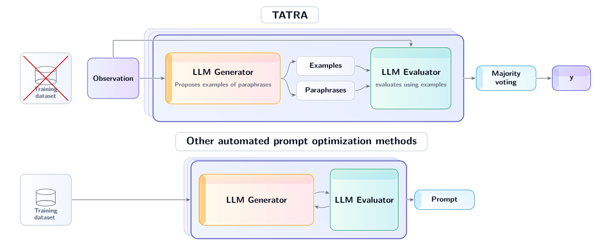

# TATRA: Training-Free Instance-Adaptive Prompting Through Rephrasing and Aggregation

**Bartosz Dziuba\*¹, Kacper Kuchta\*¹, Paweł Batorski\*², Przemysław Spurek¹³, Paul Swoboda²**

*arXiv:submit/7240589 [cs.AI] 6 Feb 2026*

## Abstract

Large Language Models (LLMs) have improved substantially alignment, yet their behavior remains highly sensitive to prompt phrasing. This brittleness has motivated automated prompt engineering, but most existing methods (i) require a task-specific training set, (ii) rely on expensive iterative optimization to produce a single dataset-level prompt, and (iii) must be rerun from scratch for each new task. We introduce TATRA, a dataset-free prompting method that constructs instance-specific few-shot prompts by synthesizing on-the-fly examples to accompany a user-provided instruction. TATRA requires no labeled training data and avoids task-specific optimization loops, while retaining the benefits of demonstration-based prompting. Across standard text classification benchmarks, TATRA matches or improves over strong prompt-optimization baselines that depend on training data and extensive search. On mathematical reasoning benchmarks, TATRA achieves state-of-the-art performance on GSM8K and DeepMath, outperform-ing methods that explicitly optimize prompts on those tasks. Our results suggest that per-instance construction of effective in-context examples is more important than running long, expensive op-timization loops to produce a single prompt per task.



**Figure 1.** Comparison of TATRA to existing automated prompt-engineering methods. Most prior approaches require a task-specific training set and run expensive dataset-level optimization loops to produce a single prompt per task. In contrast, TATRA is training-free and dataset-free, constructing a small set of instance-specific few-shot demonstrations on the fly and aggregating predictions across rephrasings for robust per-sample prompting.

## Installation

To install the necessary environment, please follow these steps using native Python virtual environments:

1.  **Create a virtual environment**:

    ```bash
    python -m venv venv
    ```

2.  **Activate the environment**:

    ```bash
    source venv/bin/activate
    ```

3.  **Install dependencies**:

    ```bash
    pip install -r requirements.txt
    ```

    Note: The code relies on `vllm` for fast inference. Ensure you have a compatible GPU environment.

## Usage

You can run experiments on text classification tasks and mathematical reasoning tasks using the provided scripts.

### Text Classification

Use `multi_task.py` to run text classification benchmarks.

```bash
# Run SST2 task with default settings
python multi_task.py --task sst2

# Run with specific parameters (paraphrases n=5, in-context examples k=8, runs=5)
python multi_task.py --task sst2 --n 5 --k 8 --runs 5
```

**Supported tasks:** `sst2`, `cr`, `mr`, `sst5`, `news`.

### Mathematical Reasoning

Use `math_tasks.py` to run mathematical reasoning benchmarks.

```bash
# Run GSM8K task
python math_tasks.py --task gsm8k

# Run DeepMath task
python math_tasks.py --task deepmath
```

**Supported tasks:** `medqa`, `gsm8k`, `deepmath`, `math500`.

### Arguments

Common arguments for both scripts:
- `--task`: Task name (required).
- `--model-path`: Path or HuggingFace ID of the model (default: `Qwen/Qwen2.5-7B-Instruct`).
- `--n`: Number of paraphrases per item.
- `--k`: Number of in-context examples.
- `--runs`: Number of repeated runs for majority voting.
- `--use-vllm`: Use vLLM for inference (1=yes, 0=no).

### Results Analysis

After running experiments, the results are saved in the `results/` directory as CSV files. You can use the `choose_best.py` script to analyze these results and find the best configuration.

```bash
python choose_best.py
```
